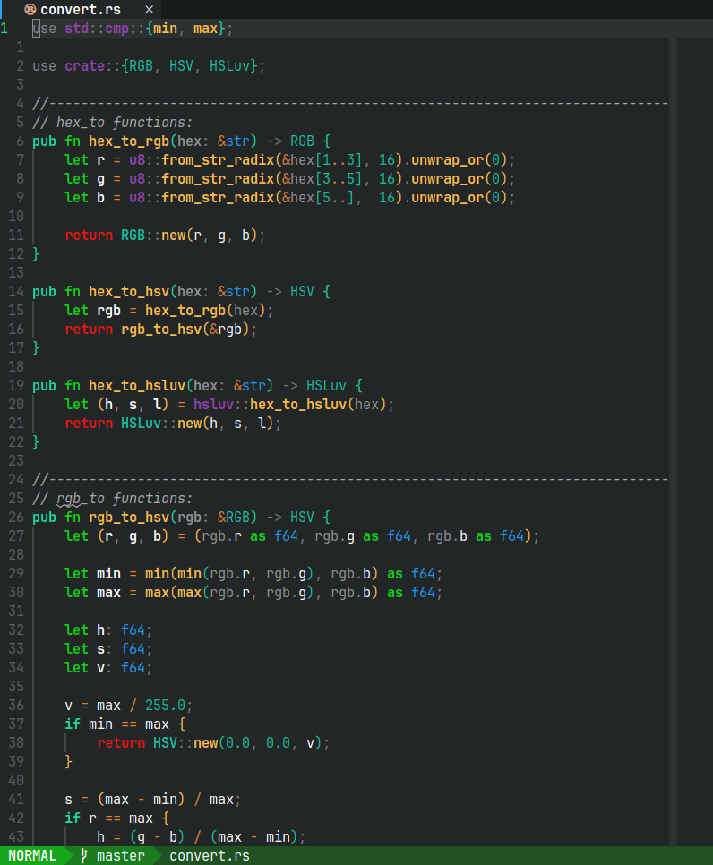
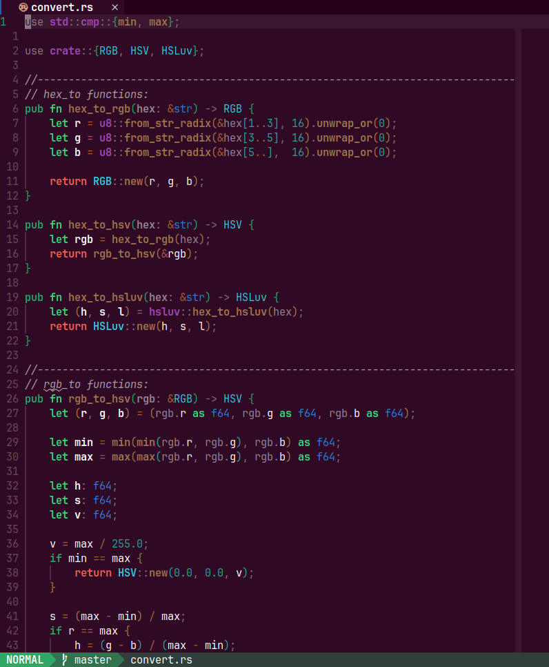
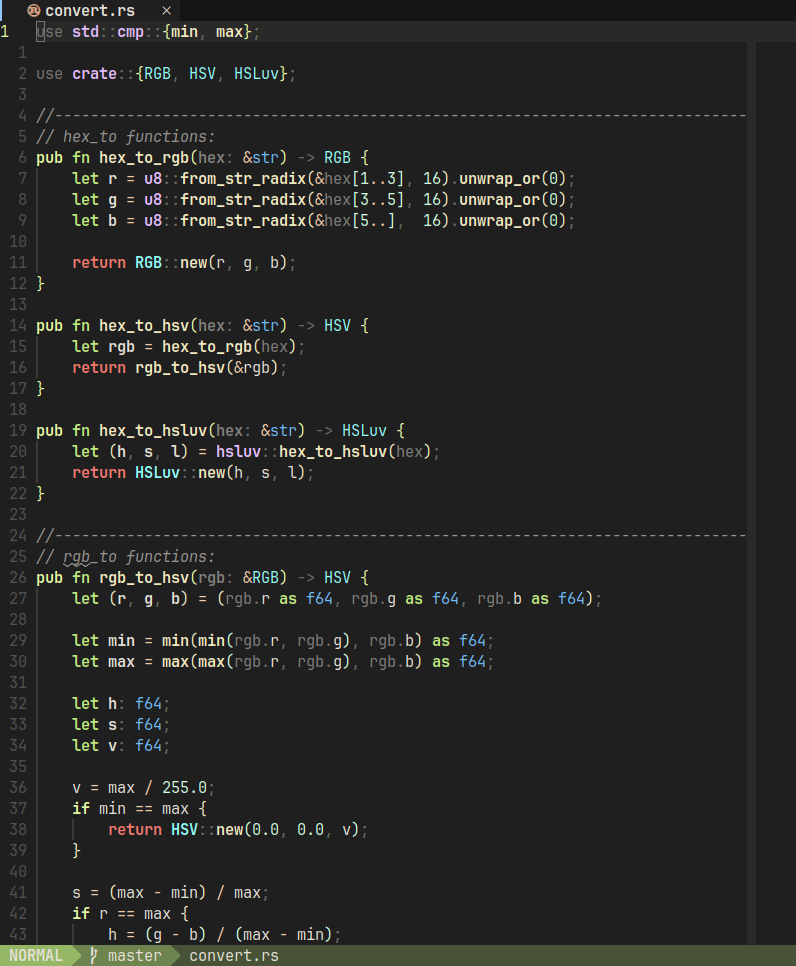

# Nova CS theme example

This is an example of a neovim color scheme that uses the Nova CS generated
palette. To use it, add this to your neovim config:

```lua
-- Load custom palette
local palette = require('YOUR_NOVA_CS_PALETTE')
require('nova_cs_theme_example').set_palette(palette)

-- Set colorscheme
vim.cmd.colorscheme 'nova_cs_theme_example'

-- Set lualine colorscheme
require('lualine').setup { options = { theme = require('nova_cs_theme_example').lualine } }
```

In the code above `local palette = require('YOUR_NOVA_CS_PALETTE')` is where
you load your Nova CS palette (which is a generated lua module).

## Screenshots

(Those particular palettes can be copied from
[this](https://github.com/5ohue/nova_cs) repo)

### Breeze:

### Darktooth:

### Everforest:

### Ubuntu:

### Wombat:

